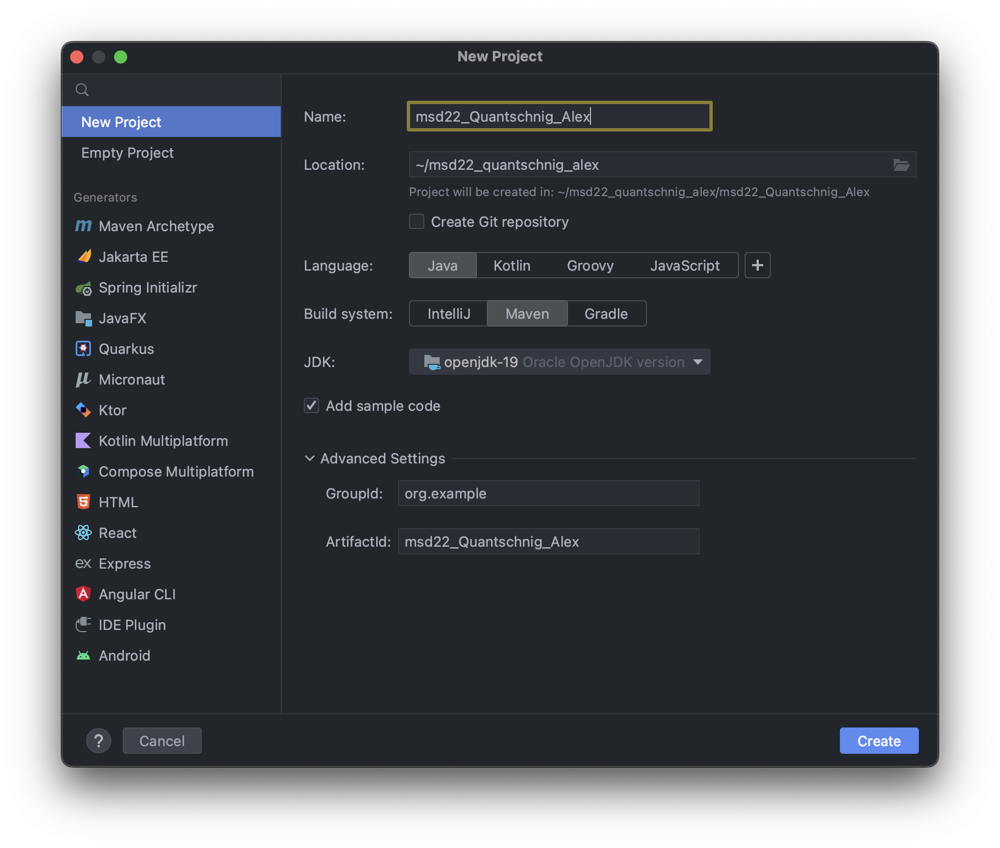
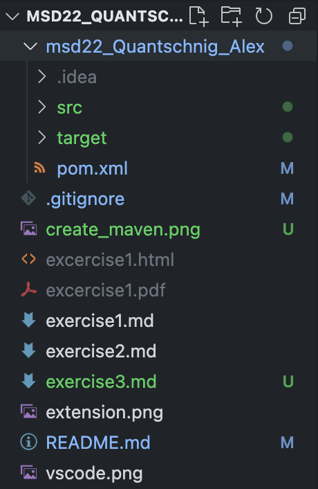
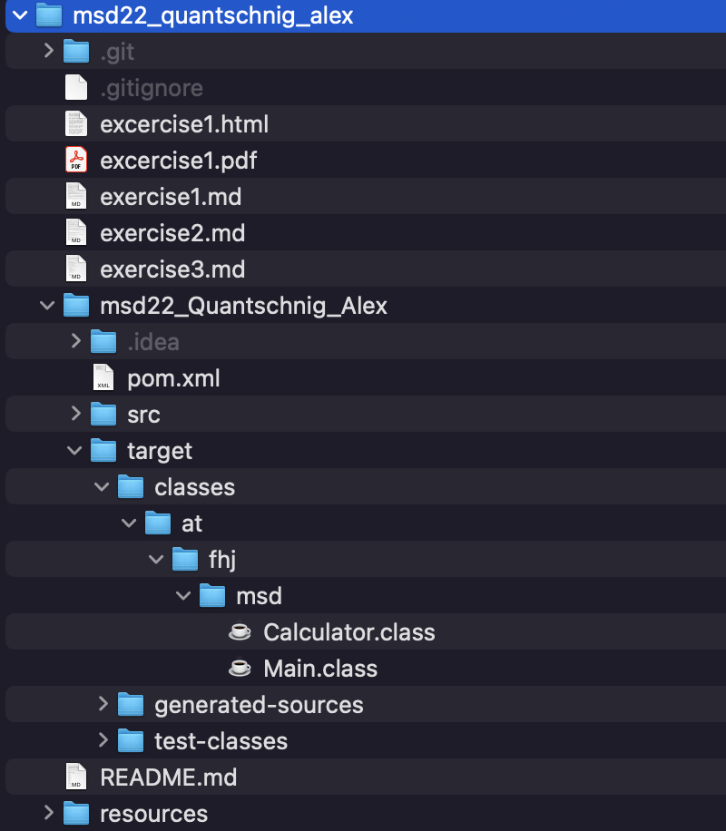
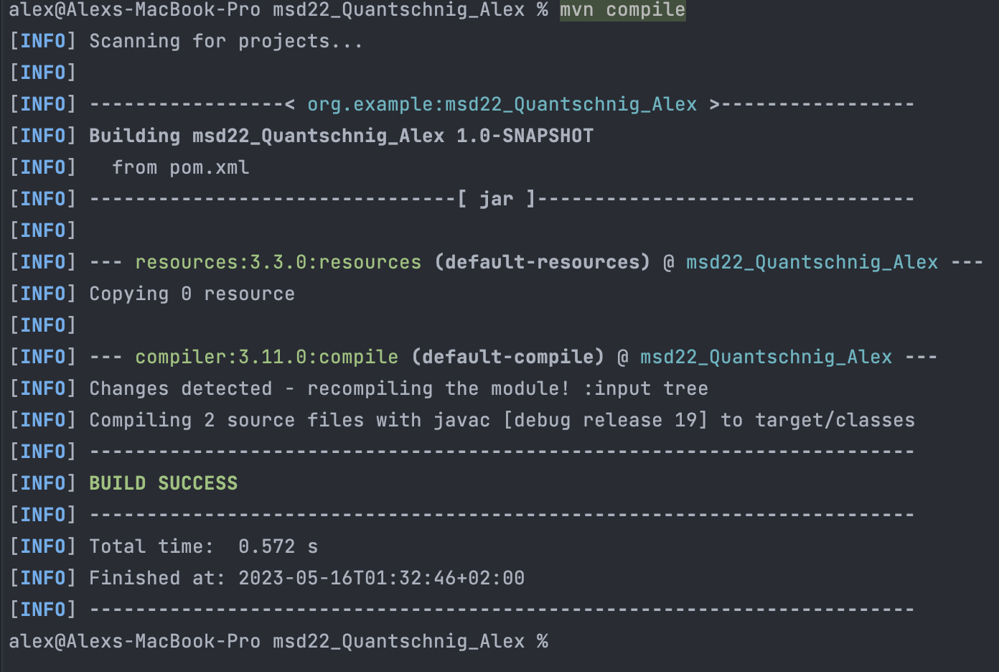

# Excercise 3

In this excercise we will create a new maven project and add it to the git repository.
We will also create a small java program which represents a simple calculator.

## Install Maven with Homebrew

1. Open a terminal and run the following command to install maven with homebrew.

    ```terminal
    brew install maven
    ```

2. Check if maven is installed correctly by running the following command.

    ```terminal
    mvn -version
    ```

## Create a new maven project

1. Open IntelliJ IDEA and create a new maven project.


2. Select the existing git repository as the project location.

3. Select Maven as the project type and click next.

4. Enter the following information and click next.

5. Add the .idea folder to the .gitignore file.

### Project structure should look like this now



## Create a simple calculator

1. Create a new java class called Calculator.
2. Add the following methods

    ```java
    public double minus(double number1,double number2){
        return number1 - number2;
    }

    public double multiply(double number1,double number2){
        return number1 * number2;
    }

    public double divide(double number1,double number2){
        return number1/number2;
    }
    public double add(double number1,double number2){
        return number1 + number2;
    }
    ```

3. Create a new java class called Main

    ```java
   public class Main {
    public static void main(String[] args) {
        Calculator calculator = new Calculator();
        System.out.println("Add: "+calculator.add(5,5));
        System.out.println("Minus: "+calculator.minus(5,5));
        System.out.println("Multiply: "+calculator.multiply(5,5));
        System.out.println("Divide: "+calculator.divide(5,5));
     }
    }
    ```
  
4. Run the Main class and check if the output is correct.

## New project structure

After running the Main class the project structure should look like this.



After running a Maven project the target folder is created.

This folder contains the compiled classes and the jar file. The jar file is the executable file of the project.

## Add the target folder to the .gitignore file

1. Open the .gitignore file and add the target folder to it.

    ```gitignore
    target
    ```

I added the target folder to the gitignore file, because we don't want to push the compiled classes  to the git repository.

## Compile the project

1. Open a terminal and navigate to the project folder.

2. Run the following command to compile the project.

    ```terminal
    mvn compile
    ```

3. Your output should look like this.

    

## Run the project in the terminal

1. Run the following command to run the project.

    ```terminal
    alex@Alexs-MBP msd22_Quantschnig_Alex % java -cp /Users/alex/msd22_quantschnig_alex/msd22_Quantschnig_Alex/target/classes at.fhj.msd.Main
    Add: 10.0
    Minus: 0.0
    Multiply: 25.0
    Divide: 1.0
    ```

2. It is importent to choose the correct path to the Main class. The path is the path to the target folder.

3. Don't to put the package name in front of the Main class.
