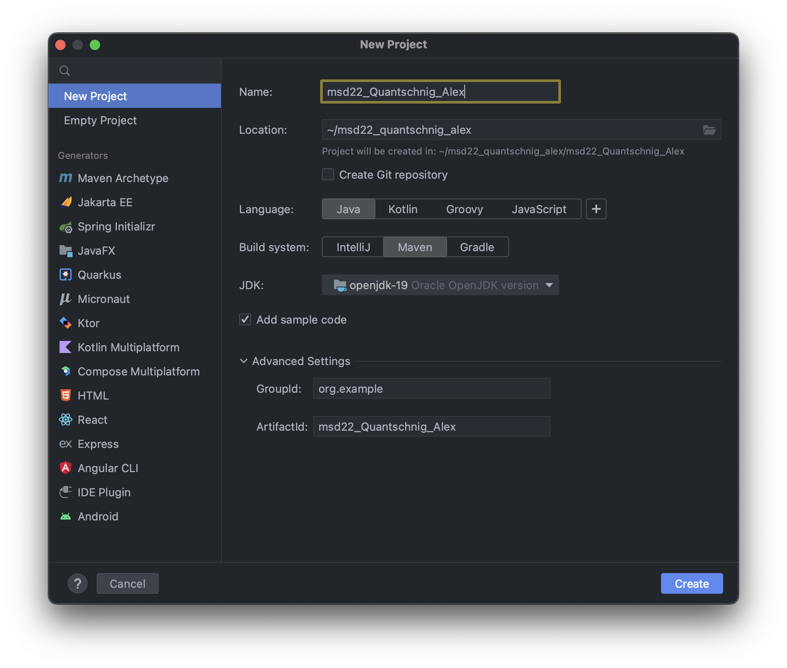

# Excercise 3

In this excercise we will create a new maven project and add it to the git repository.
We will also create a small java program which represents a simple calculator.

## Install Maven with Homebrew

1. Open a terminal and run the following command to install maven with homebrew.

    ```terminal
    brew install maven
    ```

2. Check if maven is installed correctly by running the following command.

    ```terminal
    mvn -version
    ```

## Create a new maven project

1. Open IntelliJ IDEA and create a new maven project.


2. Select the existing git repository as the project location.

3. Select Maven as the project type and click next.

4. Enter the following information and click next.

5. Add the .idea folder to the .gitignore file.

### Project structure should look like this now


