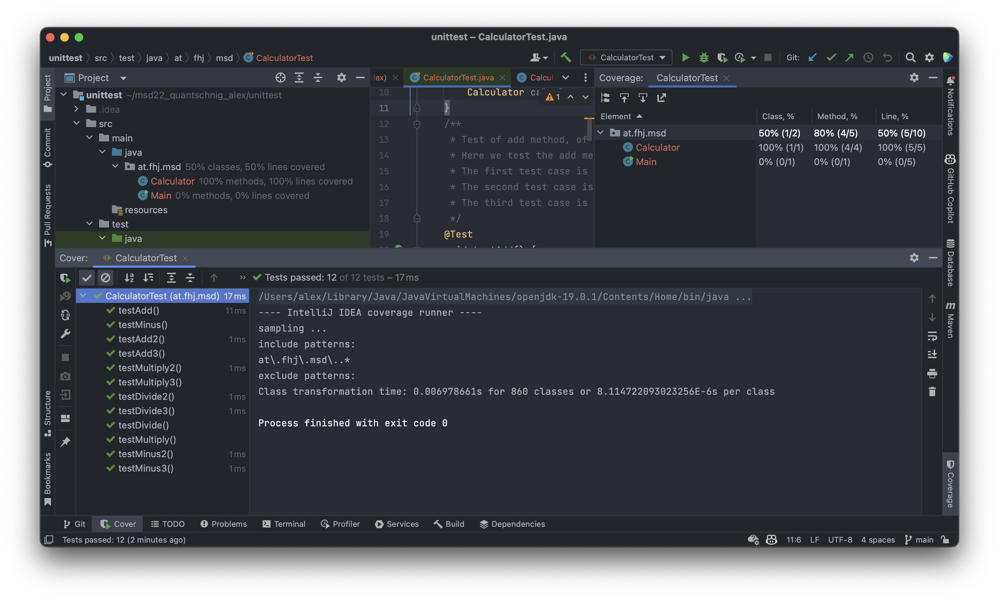
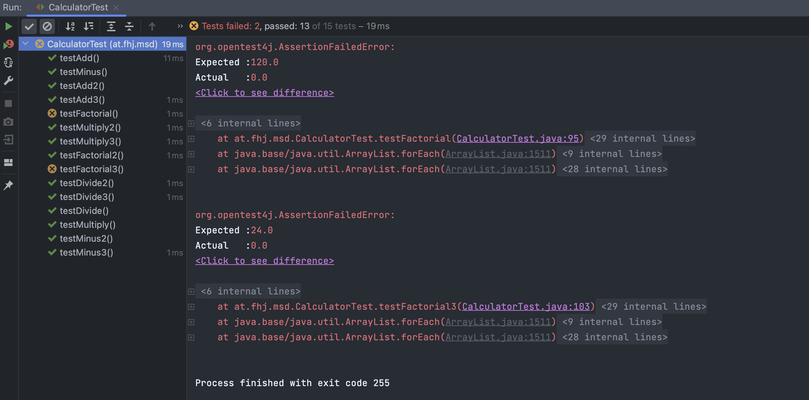
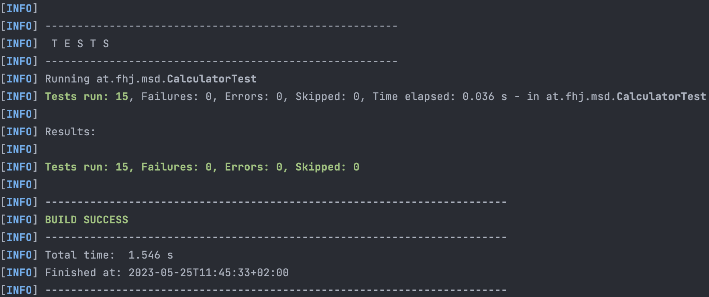

# Exercise 4: JUnit tests

In this excercise we will create different JUnit tests for the Calculator class.

## Create a new JUnit test class

1. Create a new java class called CalculatorTest in the test folder.

## Add the following tests

### Dont forget to add @BeforeEach

```java
public class CalculatorTest {
    private Calculator calculator;
    @BeforeEach
    public void setup() {
         calculator = new Calculator();
    }
    /**
     * Test of add method, of class Calculator.
     * Here we test the add method of the Calculator class with 3 different test cases.
     * The first test case is a simple addition of 2 positive numbers.
     * The second test case is a simple addition of 2 positive numbers, one of them is a double.
     * The third test case is a simple addition of 2 negative numbers.
     */
    @Test
    void testAdd() {
        Assertions.assertEquals(8.0, calculator.add(5, 3));
    }
    @Test
    void testAdd2() {
        Assertions.assertEquals(24.55, calculator.add(21.55, 3));
    }
    @Test
    void testAdd3() {
        Assertions.assertEquals(-8, calculator.add(-5, -3));
    }

    /**
     * Test of minus method, of class Calculator.
     * Here we test the minus method of the Calculator class with 3 different test cases.
     * The first test case is a simple subtraction of 2 positive numbers.
     * The second test case is a simple subtraction of 2 positive numbers, the result is 0.
     * The third test case is a simple subtraction of 2 a negative and a positive number.
     */
    @Test
    void testMinus() {
        Assertions.assertEquals(2.0, calculator.minus(5, 3));
    }
    @Test
    void testMinus2() {
        Assertions.assertEquals(0, calculator.minus(5, 5));
    }
    @Test
    void testMinus3() {
        Assertions.assertEquals(-8, calculator.minus(-5, 3));
    }

    /**
     * Test of multiply method, of class Calculator.
     * Here we test the multiply method of the Calculator class with 3 different test cases.
     * The first test case is a simple multiplication of 2 positive numbers.
     * The second test case is a simple multiplication of 2 positive numbers, one of them is 0.
     * The third test case is a simple multiplication of 2 a negative and a positive number.
     */
    @Test
    void testMultiply() {
        Assertions.assertEquals(15.0, calculator.multiply(5, 3));
    }
    @Test
    void testMultiply2() {
        Assertions.assertEquals(0, calculator.multiply(5, 0));
    }
    @Test
    void testMultiply3() {
        Assertions.assertEquals(-15.54, calculator.multiply(5.18, -3));
    }

    /**
     * Test of divide method, of class Calculator.
     * Here we test the divide method of the Calculator class with 3 different test cases.
     * The first test case is a simple division of 2 positive numbers.
     * The second test case is a simple division of 2 positive numbers, one of them is 0.
     * The third test case is a simple division of 2 a negative and a positive number.
     */
    @Test
    void testDivide() {
        Assertions.assertEquals(1.667, calculator.divide(5, 3), 0.001);
    }
    @Test
    void testDivide2() {
        Assertions.assertEquals(0, calculator.divide(0, 3));
    }
    @Test
    void testDivide3() {
        Assertions.assertEquals(-1.667, calculator.divide(5, -3), 0.001);
    }
    @Test
    void testFactorial() {
        Assertions.assertEquals(120, calculator.factorial(5));
    }
}

```

## Test coverage

1. Run the tests and check the test coverage.


## Implement Factorial method in Calculator class

First we will just create the method and it will return 0.

```java
public double factorial(double number1){

        return 0;
    }
```

### Create a new test for the factorial method

```java
 /**
     * Test of factorial method, of class Calculator.
     * Here we test the factorial method of the Calculator class with 3 different test cases.
     * The first test case is a simple factorial of a positive number.
     * The second test case is a simple factorial of a negative number.
     * The third test case is a simple factorial of a positive number.
     */
    @Test
    void testFactorial() {
        Assertions.assertEquals(120, calculator.factorial(5));
    }
    @Test
    void testFactorial2() {
        Assertions.assertEquals(0, calculator.factorial(-1));
    }
    @Test
    void testFactorial3() {
        Assertions.assertEquals(24, calculator.factorial(4));
    }
```

### Run the tests



## Run mvn test


