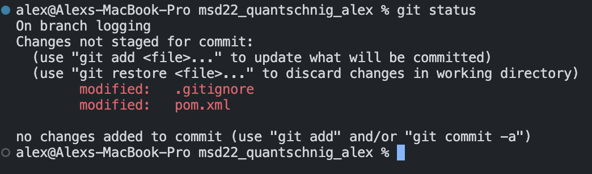
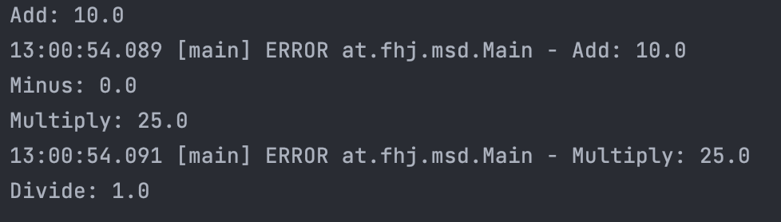
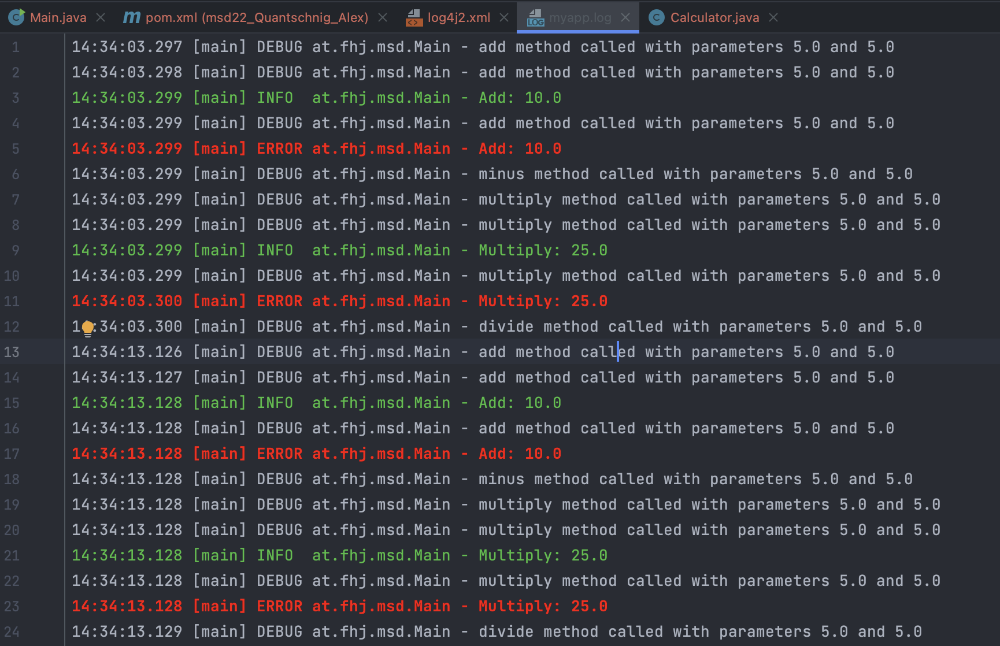
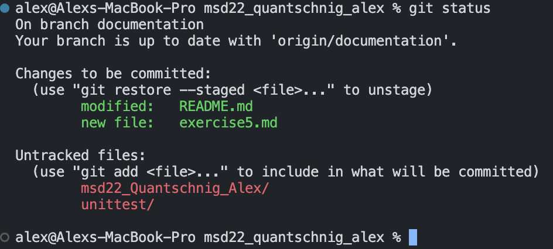

# Exercise 5 - Logging

In this exercise we will add logging to our application.

## Why are logging libraries useful?

Logging is a very important part of any application. It allows us to see what is happening in our application at any given time. It is also very useful for debugging purposes. If we have a bug in our application, we can use logging to see what is happening in our application at the time of the bug.

## What type of logging levels are there in Log4J and what do they mean?

There are 8 different logging levels in Log4J:

- ALL: The lowest logging level that enables logging of all messages.

- TRACE: A very detailed logging level used to trace program execution flow. It provides the most fine-grained information.

- DEBUG: Used for debugging purposes, providing information that helps diagnose issues during development or troubleshooting.

- INFO: Provides informational messages about the normal execution of the application. It gives a high-level view of the application's behavior.

- WARN: Indicates potential issues or situations that could lead to errors in the future. It's used to highlight non-critical problems.

- ERROR: Represents error conditions that may impact the functionality of the application, but the application can still continue execution.

- FATAL: The most severe logging level, representing critical errors that lead to application failure or termination.

- OFF: The highest logging level that turns off logging completely. No log messages will be output when this level is enabled.

## What diffrent configurations are there in Log4J?

- Configuration file: This configuration method uses an XML, JSON, YAML, or poperties format to configure the logging levels and appenders.

- Programmatic configuration: This configuration method uses Java code to configure the logging levels and appenders.

## Git status after adding dependencies to pom.xml

```xml
 <dependency>
            <groupId>org.apache.logging.log4j</groupId>
            <artifactId>log4j-core</artifactId>
            <version>2.20.0</version>
        </dependency>
```



## Output in the conosle after adding loggs to the Main



You can only see error and fatal because the default level is set to error. If you want to see all the logs you have to change the level to all in the log4j2.xml file.

## log4j2.xml file

```xml
<?xml version="1.0" encoding="UTF-8"?>
<Configuration status="WARN">
    <Appenders>
        <File name="File" fileName="logs/myapp.log">
            <PatternLayout pattern="%d{HH:mm:ss.SSS} [%t] %-5level %logger{36} - %msg%n"/>
        </File>
        <Console name="Console" target="SYSTEM_OUT">
            <PatternLayout pattern="%d{HH:mm:ss.SSS} [%t] %-5level %logger{36} - %msg%n"/>

        </Console>
    </Appenders>
    <Loggers>
        <Root level="trace">
            <AppenderRef ref="Console"/>
            <AppenderRef ref="File"/>
        </Root>
    </Loggers>
</Configuration>
```

Now you can see all the logs in the logs/myapp.log file.



## Git status after adding exercise5.md to the documentation branch


