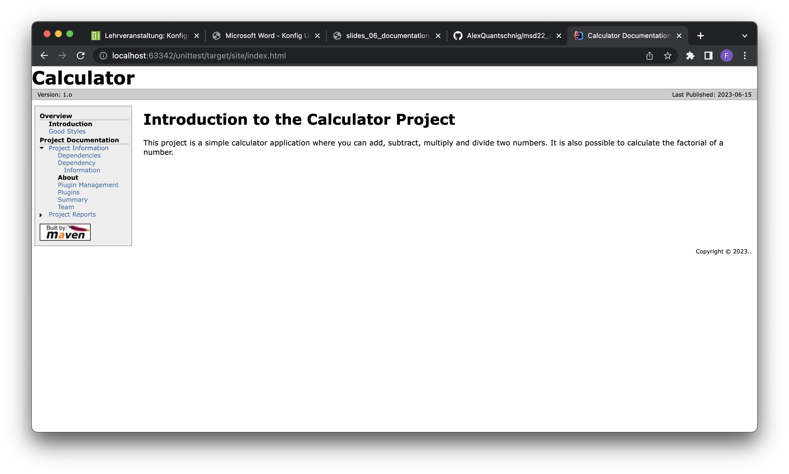
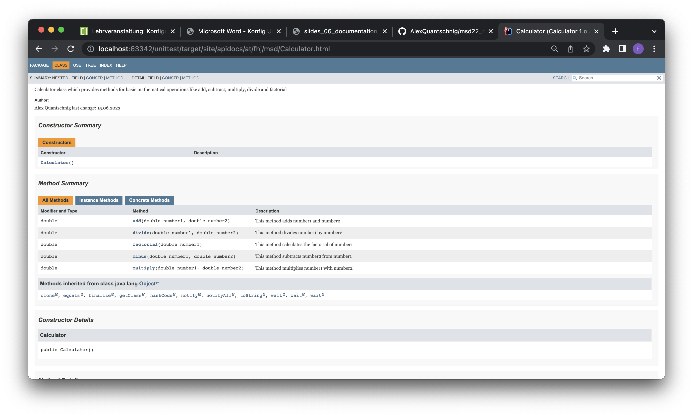
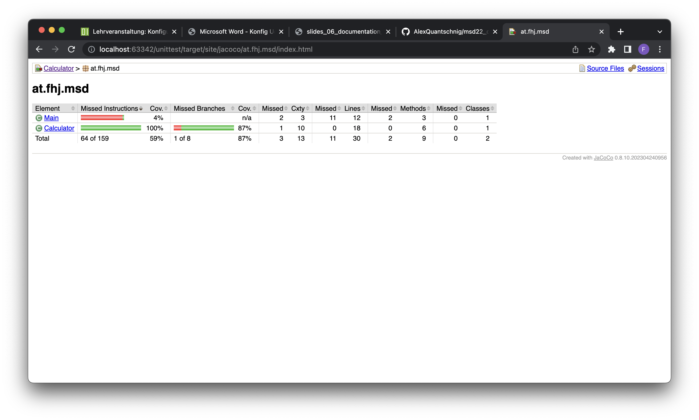

# Exercise 6 - Maven_Site

In this exercise we will create a Maven site for our project.

## What is a Maven site?

A Maven site is a website that is generated by Maven. It contains information about the project, such as:

- Project reports
- Project dependencies
- Project team members

## How do you generate a Maven site?

Don't forget to add the following plugins to the pom.xml file:

```xml
<plugins>
            <!--  maven site for documentation  -->
            <plugin>
                <groupId>org.apache.maven.plugins</groupId>
                <artifactId>maven-project-info-reports-plugin</artifactId>
                <version>3.4.1</version>
            </plugin>
            <plugin>
                <groupId>org.apache.maven.plugins</groupId>
                <artifactId>maven-site-plugin</artifactId>
                <version>3.12.1</version>
            </plugin>
            <!--  Java Doc within Maven Site Documentation -->
            <plugin>
                <groupId>org.apache.maven.plugins</groupId>
                <artifactId>maven-javadoc-plugin</artifactId>
                <version>3.5.0</version>
                <configuration>
                    <!--  Disable JavaDoc warnings  -->
                    <additionalJOption>-Xdoclint:none</additionalJOption>
                </configuration>
            </plugin>
            <!--  Test Coverage from JaCoCo Plugin integration in Maven Site Documentation  -->
            <plugin>
                <groupId>org.jacoco</groupId>
                <artifactId>jacoco-maven-plugin</artifactId>
                <version>0.8.10</version>
                <reportSets>
                    <reportSet>
                        <reports>
                            <!--  select non-aggregate reports  -->
                            <report>report</report>
                        </reports>
                    </reportSet>
                </reportSets>
            </plugin>
        </plugins>
```

Create a new folder called site in the src folder.

Within the site folder create a new folder called markdown, where you place all your markdown files.

Within the site folder create a new file called site.xml.

The site.xml file should look something like this:

```xml
<?xml version="1.0" encoding="UTF-8"?>
<project name="Calculator Documentation">
    <publishDate position="right"/>
    <version position="left"/>
    <body>
        <menu name="Overview">
            <item name="Introduction" href="index.html"/>
            <item name="Good Styles" href="good_style.html"/>
        </menu>
        <menu ref="reports"/>
    </body>
</project>
```

To generate a Maven site you have to run the following command in the terminal:

```bash
mvn site
```

After running this command you will see a new folder called target. In this folder you will find a folder called site. In this folder you will find the generated Maven site.

To open the site you have to open the index.html file in the browser.

It should look something like this:



### Javadoc API

The Javadoc API is a documentation generator for Java. It generates documentation from Java source code.

The Javadoc is also generated by Maven.

After runnin mvn site you can view them on your site.
They should look something like this:



### JUnit test reports

The JUnit test reports are also generated by Maven.

After runnin mvn site you can view them on your site.

They should look something like this:


